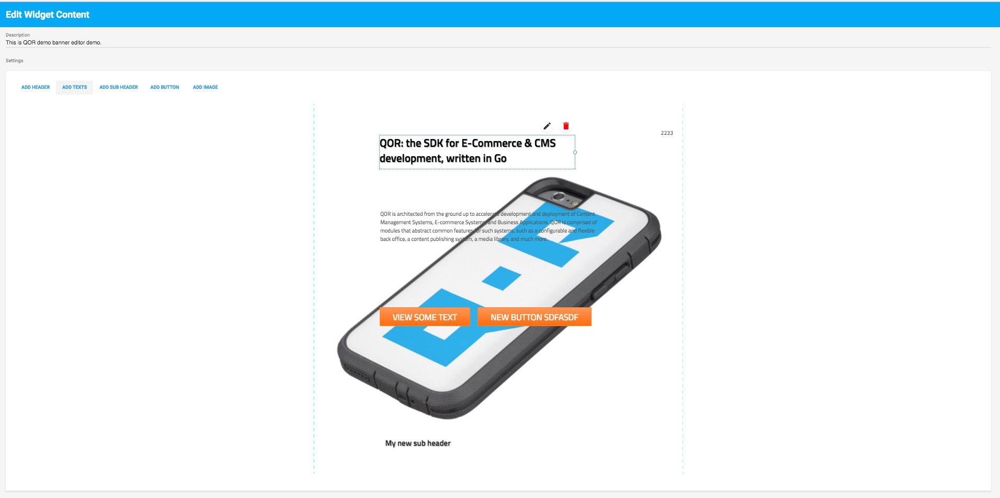

# BannerEditor

A visual editor to design a banner with customizing elements, e.g. Text, Button, etc. You could drag element and edit element attributes (font, color and more).

Screenshot:



# How to configure meta as banner_editor

```go
// Page resource that will has a banner_editor meta
type Page struct {
  gorm.Model
  BannerHTML string
}

// Define element's attributes
type buttonSetting struct {
  Text  string
  Link  string
  Color string
}

type subHeaderSetting struct {
  Text  string
  Color string
}

buttonRes := Admin.NewResource(&buttonSetting{})
buttonRes.Meta(&admin.Meta{Name: "Text"})
buttonRes.Meta(&admin.Meta{Name: "Link"})

subHeaderRes := Admin.NewResource(&subHeaderSetting{})
subHeaderRes.Meta(&admin.Meta{Name: "Text"})
subHeaderRes.Meta(&admin.Meta{Name: "Color"})

// Important: configure element's template path
banner_editor.RegisterViewPath("github.com/qor/banner_editor/test/views")

banner_editor.RegisterElement(&banner_editor.Element{
  Name:     "Button",
  Template: "button", // Looking: https://github.com/qor/banner_editor/blob/master/test/views/button.tmpl
  Resource: buttonRes,
  Context: func(c *admin.Context, r interface{}) interface{} {
    setting := r.(QorBannerEditorSettingInterface).GetSerializableArgument(r.(QorBannerEditorSettingInterface)).(*buttonSetting)
    return setting
  },
})

PageResource := Admin.AddResource(&Page{})
PageResource.Meta(&admin.Meta{Name: "BannerHTML", Config: &banner_editor.BannerEditorConfig{}})

// page.BannerHTML is a json value, you need to call banner_editor.GetContentByPlatform in order to get correct HTML.
page := Page{}
db.First(&page)
banner_editor.GetContentByPlatform(page.BannerHTML, nil) // Will return generated HTML,
```

# How to specified elements in banner_editor's toolbar

```go
PageResource.Meta(&admin.Meta{Name: "BannerHTML", Config: &banner_editor.BannerEditorConfig{
  Elements: []string{"Button"}, // elements you would like to display
}})
```

# Support display different banner for different device, e.g. laptop, mobile and tablet

```go
// Using this configure will support create different size banner for laptop and tablet
PageResource.Meta(&admin.Meta{Name: "BannerHTML", Config: &banner_editor.BannerEditorConfig{
  Platforms: []Platform{
    {
      Name:     "Laptop",
      // SafeArea used to defined the operable area in banner editor
      SafeArea: Size{Width: 1000, Height: 500},
    },
    {
      Name:     "Mobile",
      SafeArea: Size{Width: 600, Height: 300},
    },
  },
}})

// Get HTML by specified platform
banner_editor.GetContentByPlatform(page.BannerHTML, "Laptop")
banner_editor.GetContentByPlatform(page.BannerHTML, "Mobile")

// Get HTML by http request
banner_editor.GetContentByPlatform(page.BannerHTML, req)
```


