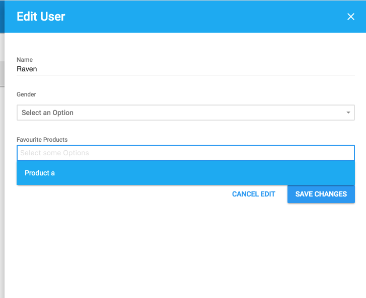

# Select Many

## Configurations

| Name | Type | Default | Description |
| --- | --- | --- | --- |
| Collection | interface{} |  | Specify the options of the *select*. Accepts a 1 or 2 dimensional arrays. |
| SelectionTemplate | string |  | Accept a file path to overwrite the default *select * template. Default path is `/metas/form/select_one`. |
| SelectMode | string | "select" | Set the data source of the options: "select", "select_async", or "bottom_sheet". |
| Select2ResultTemplate | template.JS |  | Same as [select2](https://select2.github.io)'s option [templateResult](https://select2.github.io/options.html#can-i-change-how-the-placeholder-looks) |
| Select2SelectionTemplate | template.JS |  | Same as [select2](https://select2.github.io)'s option [templateSelection](https://select2.github.io/options.html#templateSelection) |
| RemoteDataResource | *Resource |  | Works in conjunction with the`SelectMode` configuration, when set to "select_async" or "bottom_sheet" the value represents the data resource. Usually this will be set by association between resources by default (see `FavouriteProducts` example below) |

## Examples

### Set option manually

Assuming, in a hypothetical project, a User has many favorite brands, like:

```
type User struct {
  gorm.Model
  Name              string
  Gender            string
  FavouriteBrands []string
}
```

...So add two hypothetical brands "AwesomeStuff" and "ExcellentStuff" as candidates.

```go
user.Meta(&admin.Meta{Name: "FavouriteBrands", Type: "select_many", Config: &admin.SelectManyConfig{Collection: []string{"AwesomeStuff", "ExcellentStuff"}}})
```

### Use association data

You can use an other resource's data as options. Assuming, in a hypothetical project, a User has some favorite products, and there is a Product called "Product a" existing in the database: QOR can associate these recources automatically, with very little configuration.

```
type User struct {
  gorm.Model
  Name              string
  Gender            string
  FavouriteProducts []Product
}

type Product struct {
  gorm.Model
  Name        string
  Description string
}

user.Meta(&admin.Meta{Name: "FavouriteProducts", Type: "select_many"})
```

Screenshot:




### Overwrite default SelectionTemplate

```go
u.Meta(&admin.Meta{Name: "FavouriteProducts", Type: "select_many", Config: &admin.SelectManyConfig{Collection: []string{"ASICS", "Lacoste"}, SelectionTemplate: "metas/form/customised_select_many.tmpl"}})
```

The above code snippet is taken from the [qor-example project](https://github.com/qor/qor-example). The full path of the `SelectionTemplate` in [qor-example](https://github.com/qor/qor-example) is `app/views/qor/metas/form/customised_select_many.tmpl`. For more about how to define/use custome templates, have a look at [QOR view paths](../chapter2/theme.md#customize-views).

### Select option in pop-up

Set the `SelectMode` as `bottom_sheet` and the options of select will be displayed in a pop-up. Too easy!
