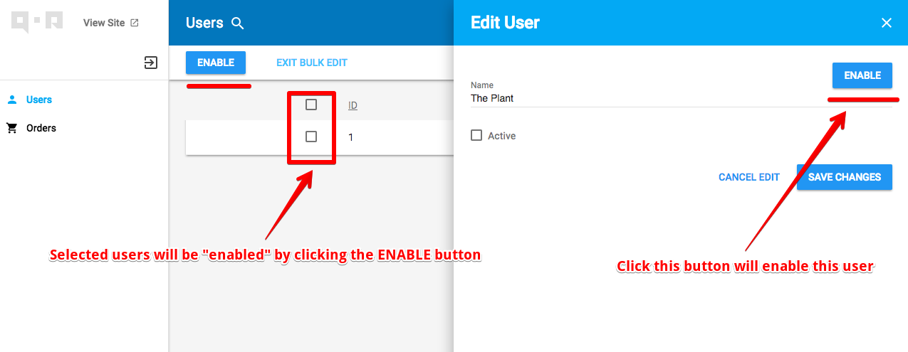

# Action

[Action](https://github.com/qor/admin/blob/master/action.go) provides a way to make shortcut functions based on [QOR Admin](../chapter2/setup.md) UI.

## Usage

Let's define a `Enable` action on user to see how [Action](https://github.com/qor/admin/blob/master/action.go) works.

First, We need set up [QOR Admin](../chapter2/setup.md) and define `User` model with `Name` and `Active`. Please check out [this document](../chapter2/setup.md) about how to setup [QOR Admin](../chapter2/setup.md). We ignored it here.

```go
type User struct {
  gorm.Model
  Name   string
  Active bool
}

user := Admin.AddResource(&models.User{})
```

Then add `Enable` action to user. The detail will be introduced later.

```go
user.Action(&admin.Action{
  Name: "enable",
  Handle: func(actionArgument *admin.ActionArgument) error {
    // `FindSelectedRecords` => return selected record in bulk action mode, return current record in other mode
    for _, record := range actionArgument.FindSelectedRecords() {
      actionArgument.Context.DB.Model(record.(*models.User)).Update("Active", true)
    }
    return nil
  },
  Modes: []string{"index", "edit", "show", "menu_item"},
})
```

Then the user `index` and `edit` page will show a button "ENABLE" like this:



### Configurations of [Action](https://github.com/qor/admin/blob/master/action.go)

| Name | Type | Description |
| --- | --- | --- |
| Name | string | The name of the action. This will be the button text if no `Label` option passed in. |
| Label | string | The button text of the action. |
| Method | string | HTTP method, default is `PUT`. When there is `URL` option, it will be `GET` by default. |
| URL | `func(record interface{}, context *admin.Context) string` | Set the URL that the action button shall trigger requests. This option will overwrite the `Handle` option. Check [Action by URL](#action-by-url) for example. |
| URLOpenType | string | Set how to open the URL, The default value for the action that has `Resource` is `bottomsheet`(the link will be opened in an popup window). For the action that has no `Resource` is `_blank`.  |
| Visible | `func(record interface{}, context *admin.Context) bool` | Set the condition of when this action is visible. [Example](#action-visible-option-demo) |
| Handle | `func(argument *ActionArgument) error` | The function to process the request from action. |
| Permission | `*roles.Permission` | Permission control, Please check [Roles](../plugins/roles.md) for more informations. |
| Resource | `*Resource` | Set resource to store user input. Check [Action with user input](#action-with-user-input) for example. |
| Modes | `[]string` | Set where the action button will appear. Support 4 options: `"index", "edit", "show", "menu_item"` |

The 4 `Modes` mapping to these pages:

* `index`, Bulk actions, will be shown in index page as bulk actions.
* `edit`, Edit form action, will be shown in edit page.
* `show`, Show page action, will be shown in show page.
* `menu_item`, Menu item action, will be shown in table's menu.

The `ActionArgument` used in `Handle` option has 3 attributes.

1. `PrimaryValues`, `[]string`. This records the object ID(s).
2. `Context`, `*admin.Context`. The context of [QOR Admin](../chapter2/setup.md). Check [Admin context](../chapter2/context.md) for more detail.
3. `Argument`, `interface{}`. The argument of user input. check [Action with user input](#action-with-user-input) for example.


### <a name='action-with-user-input'></a> Register [Action](https://github.com/qor/admin/blob/master/action.go) that need user's input

You need define a resource to store the user input and fetch or use it in the `Handle` function.

```go
order.Action(&admin.Action{
  Name: "Ship",
  Handle: func(argument *admin.ActionArgument) error {
    // Get the user input from argument.
    trackingNumberArgument := argument.Argument.(*trackingNumberArgument)

    for _, record := range argument.FindSelectedRecords() {
      argument.Context.GetDB().Model(record).UpdateColumn("tracking_number", trackingNumberArgument.TrackingNumber)
    }
    return nil
  },
  Resource: Admin.NewResource(&trackingNumberArgument{}),
  Modes: []string{"show", "menu_item"},
})

// the ship action's argument
type trackingNumberArgument struct {
  TrackingNumber string
}
```

### <a name="action-visible-option-demo"></a> Use `Visible` to display `Cancel` order action in "draft" and "processing" state only.

The `record` parameter of `Visible` option is the current order. We can determine order state by it. When the return value is false, this action is invisible to user.

```go
order.Action(&admin.Action{
  Name: "Cancel",
  Handle: func(argument *admin.ActionArgument) error {
    // cancel the order
  },
  Visible: func(record interface{}) bool {
    if order, ok := record.(*models.Order); ok {
      for _, state := range []string{"draft", "processing"} {
        if order.State == state {
          return true
        }
      }
    }
    return false
  },
  Modes: []string{"show", "menu_item"},
})
```

### <a name="action-by-url"></a> Process action by `URL`

This example shows how to make an action that user could click it to view product detail page at the front-end. The `record` parameter of `URL` function is the current product, we make the URL to front-end by the product's code.

```go
  product.Action(&admin.Action{
    Name: "View On Site",
    URL: func(record interface{}, context *admin.Context) string {
      if product, ok := record.(*models.Product); ok {
        return fmt.Sprintf("/products/%v", product.Code)
      }
      return "#"
    },
    Modes: []string{"menu_item", "edit"},
  })
```
