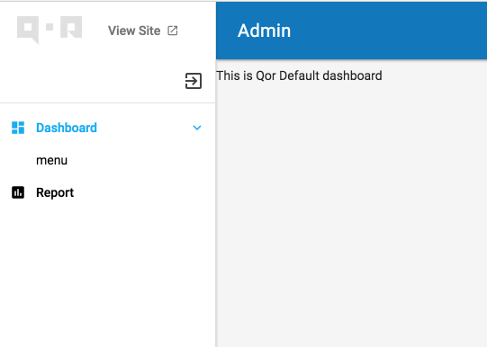

# Menus

#### Register a Menu

It is possible to define a nested menu structure for the [QOR Admin](../chapter2/setup.md) interface.

```go
Admin.AddMenu(&admin.Menu{Name: "Dashboard", Link: "/admin"})

// Register nested menu, The "menu" under "Dashboard"
Admin.AddMenu(&admin.Menu{Name: "menu", Link: "/link", Ancestors: []string{"Dashboard"}})

// Register menu with permission, User has "admin" permission could access "Report" page.
Admin.AddMenu(&admin.Menu{Name: "Report", Link: "/admin", Permission: roles.Allow(roles.Read, "admin")})
```



Please check [Roles](../plugins/roles.md) for more permission control informations.

#### Add Resources to a menu

By default, `Resource` will be listed at the top level of menu. You can set the position manually.

```go
Admin.AddResource(&User{})

Admin.AddResource(&Product{}, &admin.Config{Menu: []string{"Product Management"}})
Admin.AddResource(&Color{}, &admin.Config{Menu: []string{"Product Management"}})
Admin.AddResource(&Size{}, &admin.Config{Menu: []string{"Product Management"}})

Admin.AddResource(&Order{}, &admin.Config{Menu: []string{"Order Management"}})
```

If you don't want a resource to be displayed in the menu, pass the `Invisible` option:

```go
Admin.AddResource(&User{}, &admin.Config{Invisible: true})
```
