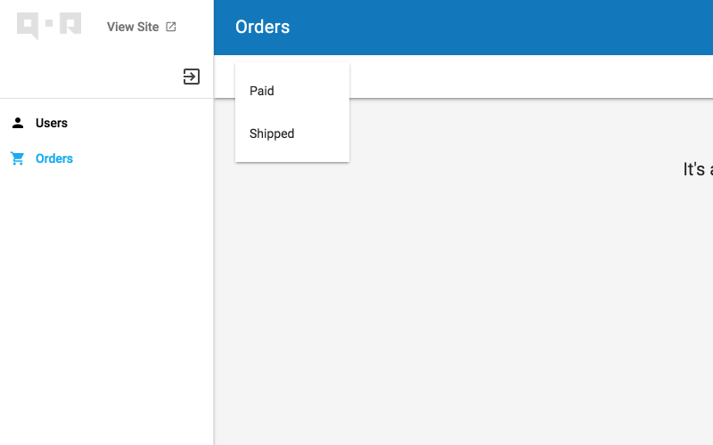

# Scopes and filters

## Filters

Make resource filter-able by given setting, This example shows how to filter users by the gender(Male, Female and Unknown).

```
  // Filter users by gender.
  user.Filter(&admin.Filter{
    Name: "Gender",
    Config: &admin.SelectOneConfig{
      Collection: []string{"Male", "Female", "Unknown"},
    },
  })
```

Screenshot:


## Scopes

You can define scopes to filter data with given conditions, for example:

```go
// Only show active users
user.Scope(&admin.Scope{Name: "Active", Handle: func(db *gorm.DB, context *qor.Context) *gorm.DB {
  return db.Where("active = ?", true)
}})
```

Screenshot


## Group Scopes

To put similar scopes into one group. Set `Group` name for it like below.

```go
order.Scope(&admin.Scope{Name: "Paid", Group: "State", Handle: func(db *gorm.DB, context *qor.Context) *gorm.DB {
    return db.Where("state = ?", "paid")
}})

order.Scope(&admin.Scope{Name: "Shipped", Group: "State", Handle: func(db *gorm.DB, context *qor.Context) *gorm.DB {
  return db.Where("state = ?", "shipped")
}})
```

Screenshot:



[Scopes Online Demo](http://demo.getqor.com/admin/products)


