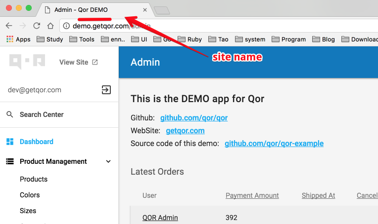

# Site Name

Use `SetSiteName` to set [QOR Admin](../chapter2/setup.md)'s HTML title.

```go
Admin.SetSiteName("Qor DEMO")
```



The name will also be used to auto-load javascripts and stylesheet files that you can provide for customizing the [QOR Admin](../chapter2/setup.md) interface.

For example, say you set the site name as `Qor Demo`, [QOR Admin](../chapter2/setup.md) will look up `{current_path}/app/views/qor/assets/javascripts/qor_demo.js` and `{current_path}/app/views/qor/assets/stylesheets/qor_demo.css`, and load them if present.
