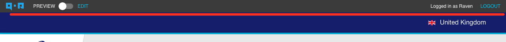

# ActionBar

[ActionBar](https://github.com/qor/action_bar) is an auxiliary UI plug-in for [QOR Admin](../chapter2/setup.md). It generates a small bar on the top of frontend pages. The bar contains:

* Switcher of `Preview` and `Edit` mode,
* Login/Logout links,
* Additional links according to [QOR Admin](../chapter2/setup.md) configuration.

[](https://godoc.org/github.com/qor/action_bar)

## Usage

Register [ActionBar](https://github.com/qor/action_bar) to [QOR Admin](../chapter2/setup.md)

```go
  ActionBar = action_bar.New(Admin)
```

Then render [ActionBar](https://github.com/qor/action_bar) in the view, usually we put it in the view context.

```go
  viewCtx["ActionBarTag"] = admin.ActionBar.Render(ctx.Writer, ctx.Request)

  // In the template
  {{.Result.ActionBarTag}}
```

The UI looks:



## Advanced usages

### Add link to [ActionBar](https://github.com/qor/action_bar)

[ActionBar](https://github.com/qor/action_bar) has a `RegisterAction` function to do so. Here's an example that adds admin link to [ActionBar](https://github.com/qor/action_bar).

```go
  ActionBar.RegisterAction(&action_bar.Action{Name: "Admin Dashboard", Link: "/admin"})
```

### Be able to edit resource in the front-end directly.

Imagine the administrator of a EC site could edit a product detail in the shopping page rather than edit it in the back-end CMS. The shopping page editing could help the administrator to have a better operation experience. We have integrated this feature to [ActionBar](https://github.com/qor/action_bar). The setup is easy.

First, register view functions. The example uses [Render](../helpers/render.md) to render the template. So we register functions by `Render.RegisterFuncMap`. The `admin.ActionBar` in the example is an instance of [QOR Admin](../chapter2/setup.md).

```go
  for key, value := range admin.ActionBar.FuncMap(ctx.Writer, ctx.Request) {
    Render.RegisterFuncMap(key, value)
  }
```

Then render the edit button in the template.

```go
// Assume this is in the product show page
{{ render_edit_button .Product }}
```

Then you will see a `Edit` button in the product show page and the administrator could edit product's info in the front-end directly.

[Online Demo](http://demo.getqor.com/), you will see a bar at the top of homepage after logged in as an administrator.
