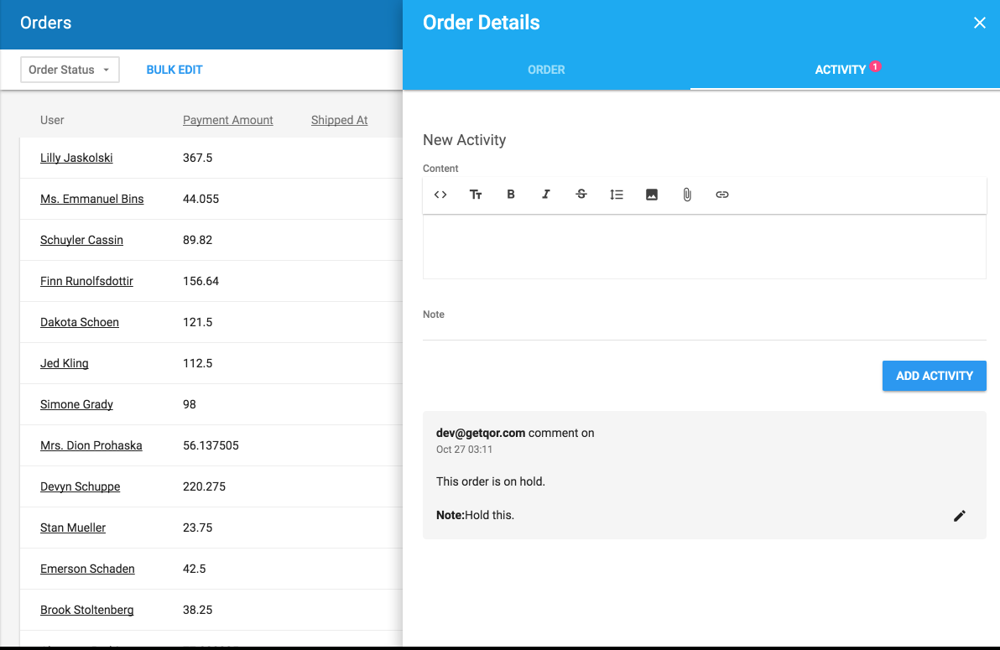

# Activity

[Activity](https://github.com/qor/activity) provides [QOR Admin](https://github.com/qor/admin) with an activity tracking feature for any [Resource](../chapter2/resource-intro.md).

Applying [Activity](https://github.com/qor/activity) to a [Resource](../chapter2/resource-intro.md) will add `Comment` and `Track` data/state changes within the [QOR Admin](https://github.com/qor/admin) interface.

[](https://godoc.org/github.com/qor/activity)

## Usage

```go
import "github.com/qor/admin"

func main() {
  Admin := admin.New(&qor.Config{DB: db})
  order := Admin.AddResource(&models.Order{})

  // Register Activity for Order resource
  activity.Register(order)
}
```

This will add activity tracking feature to order like:



[Online Demo](http://demo.getqor.com/admin/orders)
