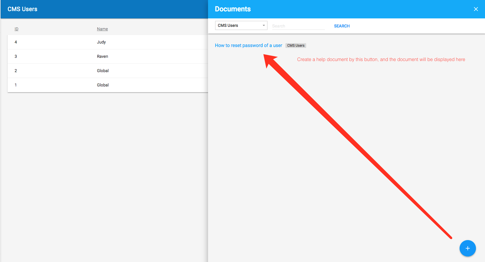

# QOR Help

QOR Help provides a way to add help documents to [QOR Admin](./chapter2/setup.md)

## Usage

First, add [QOR Help](https://github.com/qor/help) table to the database.

```go
  db.DB.AutoMigrate(&help.QorHelpEntry{})
```

Then add [QOR Help](https://github.com/qor/help) to [QOR Admin](./chapter2/setup.md).

```go
  Admin.NewResource(&help.QorHelpEntry{})
```

Now start your application. You should see a question mark icon appears at the top right corner of [QOR Admin](./chapter2/setup.md) interface.


Click the icon, a slide panel should appear



The Admin user could get knowledge from here directly.
