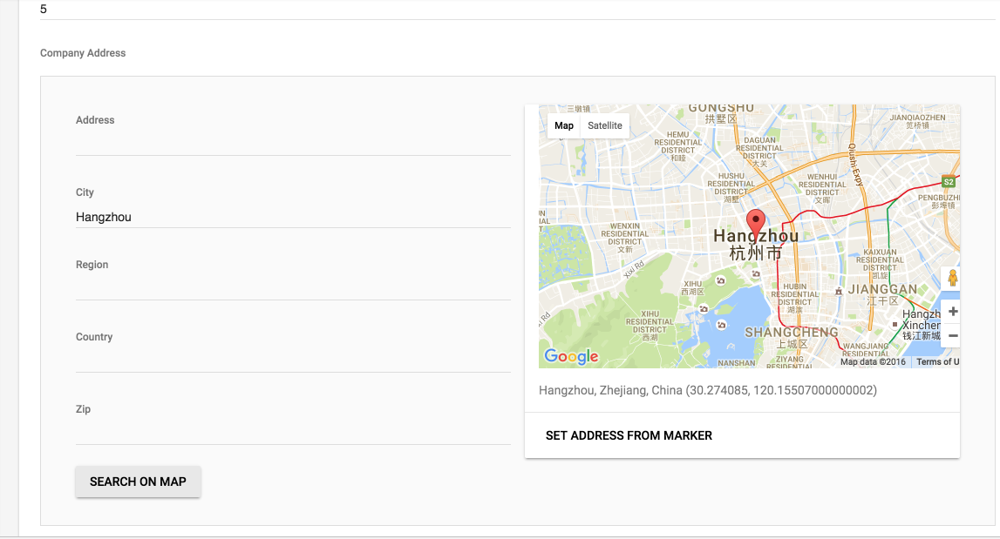

# Location

[Location](https://github.com/qor/location) picks up location details from an interactive Google Map widget when creating/editing any applicable Resource in [Qor Admin](http://github.com/qor/admin).

# Usage

To use [Location](https://github.com/qor/location) with [QOR Admin](../chapter2/setup.md), simply embed `location.Location` in a model then behold the map picker in the [QOR Admin](../chapter2/setup.md) interface.

```go
import (
  "github.com/jinzhu/gorm"
  "github.com/qor/location"
)

type Store struct {
  gorm.Model
  Name string
  location.Location
}
```

Embedded `location.Location` brings these attributes to your struct

```go
type Location struct {
  Address   string
  City      string
  Region    string
  Country   string
  Zip       string
  Latitude  float64
  Longitude float64
}
```

Now, you can call `Store.Address` or `Store.Country` etc. to get the address of the store.

Screenshot:



[Location Demo:  http://demo.getqor.com/admin/setting](http://demo.getqor.com/admin/setting)
