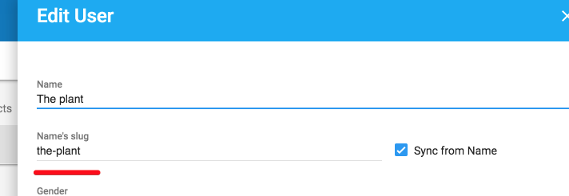

# Qor Slug

[Slug](https://github.com/qor/slug) provides an easy way to create a [pretty URL](https://en.wikipedia.org/wiki/Semantic_URL#Slug), a.k.a. [Search Engine Friendly (SEF) URL](https://en.wikipedia.org/wiki/Semantic_URL#Slug), for your model.

[](https://godoc.org/github.com/qor/slug)

## Usage

Use `slug.Slug` as your field type with the same name as the benefactor field, from which the slug's value should be dynamically derived, and prepended with `WithSlug`, for example:

```go
import (
  "github.com/jinzhu/gorm"
  "github.com/qor/slug"
)

type User struct {
  gorm.Model
  Name            string
  NameWithSlug    slug.Slug
}
```

In the [QOR Admin](./chapter2/setup.md), You can see:



Suppose you generate user profile page URL by `NameWithSlug`. The URL shall be `/users/the-plant` which is prettier and safer than `/users/1`.
